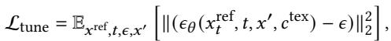

[placeholder: image]


[description: --- 图像分析结果 ---

Here's an analysis of the provided scientific image:

**1. Type of Plot/Figure:**

The figure is a flowchart or schematic diagram illustrating a computational process, specifically an image editing or generation pipeline.  It does not present data in a typical plot format (like a scatter plot or bar chart).


**2. Main Finding or Conclusion:**

The figure does not present a finding or conclusion in the traditional sense of research results. Instead, it details the architecture of a system for image manipulation using a combination of Stable Diffusion, LoRA (Low-Rank Adaptation), and ControlNet.  The conclusion implied is that the described system can successfully take a degraded image and a reference image as inputs to generate an improved image by leveraging both image and text information.


**3. Key Data Points or Significant Numbers:**

The figure does not contain any quantitative data points or numerical values.  It focuses on the flow of information and operations.


**4. Trend or Relationship Shown:**

The diagram demonstrates a workflow.  The relationship shown is the sequential and parallel processing steps involved in the image restoration or generation process.  Key relationships include:

* **Reference Image + Gaussian Noise:**  A noisy version of the reference image is created.
* **Degraded Image Input:** A degraded image serves as a guide.
* **Stable Diffusion + LoRA:** These two components are used for image generation or manipulation.
* **ControlNet:** Guides the generation process using the degraded image.
* **Text Prompt:** The text prompt ("A photo of [V]") provides additional semantic information guiding the generation process.
* **Ltune:** A loss function is used to tune the model's output.
* **Gradient Flow:** This is shown to influence parts of the process, representing the backpropagation of errors for training or optimization.
* **Operation Flow:** Demonstrates the general flow of data through the model.


In summary, the image illustrates a complex computational pipeline, not a representation of quantitative experimental data.  It visually describes the architecture of a novel method for image editing, which uses a combination of pre-trained models and control mechanisms to refine or restore images.


").
* `L<sub>tune</sub>`:  Indicates a tuning loss function.


**4. Trend or Relationship Shown:**

The diagram shows a process where:

* A reference image (`xref`) is initially degraded by adding Gaussian noise (`ε`), creating `x'`.
* This degraded image and text prompt (`C<sup>tex</sup>`) are fed into a Stable Diffusion model enhanced by LoRA and ControlNet.
* The model, using ControlNet's guidance and LoRA's efficient parameter tuning, predicts the noise (`εθ`) that needs to be removed or manipulated to match the reference image and the text prompt.
* The predicted noise is then used to refine the initial image, resulting in potentially a better version of the original image or a new image based on both the reference image and the text description.
* The process involves both the forward operation flow (black arrows) and a gradient flow (light blue arrows), which suggests an iterative optimization process is used to reduce the difference between the reference image and the modified image.

In summary, the image is a qualitative representation of a sophisticated image processing or generative model pipeline, not a presentation of quantitative research results.


--------------------]  
Fig. 3. Illustration of Gaussian repair model setup. First, we add Gaussian noise ?? to a reference image ??ref to form a noisy image. Next, this noisy image along with ??ref’s corresponding degraded image ??′ are passed to a pre-trained fixed ControlNet with learnable LoRA layers to predict a noise distribution ???? . We use the differences among ?? and ???? to fine-tune the parameters in LoRA layers.

still suffers in regions that are poorly observed, regions with occlusion, or even unobserved regions. These challenges loom over the completeness of the reconstruction, like the sword of Damocles.

To mitigate these issues, we introduce a Gaussian repair model R designed to correct the aberrant distribution of G?? . Our R takes corrupted rendered images ??′ (G??, ??nov) as input and outputs photorealistic and high-fidelity images ??ˆ. This image repair capability can be used to refine the 3D Gaussians, leading to learning better structure and appearance details.

Sufficient data pairs are essential for training R but are rare in existing datasets. To this end, we adopt two main strategies for generating adequate image pairs, i.e., leave-one-out training and adding 3D noises. For leave-one-out training, we build ?? subsets from the ?? input images, each containing ?? − 1 reference images and 1 left-out image ??out. Then we train ?? 3DGS models with reference images of these subsets, termed as {G???? }?? −1??=0 . After specific iterations, we use the left-out image ??out to continue training each Gaussian model {G???? }?? −1??=0 into {Gˆ???? }?? −1??=0 . Throughout this process, are stored to form the image pairs along with left-out image ??out for training the repair model. Note that training these left-out models costs little, with less than ?? minutes in total. The other strategy is to add 3D noises ???? onto Gaussian attributes. The ???? are derived from the mean Δ and variance Δ of attribute differences between{G???? }?? −1??=0 and {Gˆ???? }?? −1??=0 . This allows us to render more degraded Gaussians, resulting in extensive image pairs (?? ′, ?? ref).

We inject LoRA weights and fine-tune a pre-trained ControlNet [Zhang et al. 2023b] using the generated image pairs as our Gaussian repair model. The training procedure is shown in Fig. 3. The loss function, based on Eq. 1, is defined as:

[placeholder: interline_equation]


[description: **公式识别结果:**

```latex
\begin{array} { r } { \mathcal { L } _ { \mathrm { t u n e } } = \mathbb { E } _ { { x } ^ { \mathrm { r e f } } , t , \epsilon , x ^ { \prime } } \left[ \| ( \epsilon _ { \theta } ( x _ { t } ^ { \mathrm { r e f } } , t , x ^ { \prime } , c ^ { \mathrm { t e x } } ) - \epsilon ) \| _ { 2 } ^ { 2 } \right] , } \end{array}
```]

where ??tex denotes an object-specific language prompt, defined as “a photo of [V],” as per Dreambooth [Ruiz et al. 2023]. Specifically, we inject LoRA layers into the text encoder, image condition branch, and U-Net for fine-tuning. Please refer to the Appendix for details.

# 3.5 Gaussian Repair with Distance-Aware Sampling

After training R, we distill its target object priors into G?? to refine its rendering quality. The object information near the reference views is abundant. This observation motivates designing distance as a criterion in identifying views that need rectification, leading to distance-aware sampling.

Specifically, we establish an elliptical path aligned with the training views and focus on a central point. Arcs near Π???? ?? , where we assume G?? renders high-quality images, form the reference path. The other arcs, yielding renderings, need to be rectified and define the repair path, as depicted in Fig. 4. In each iteration, novel viewpoints, ???? ∈ Πnov, are randomly sampled among the repair path. For each ???? , we render the corresponding image ?? ?? (G??, ???? ), encode it to be E (?? ?? ) by the latent diffusion encoder E and pass E (?? ?? ) to the image conditioning branch of R. Simultaneously, a cloned E (?? ?? ) is disturbed into a noisy latent ???? :

[placeholder: interline_equation]


[description: **公式识别结果:**

```latex
z _ { t } = \sqrt { \bar { \alpha } _ { t } } \mathcal { E } ( x _ { j } ) + \sqrt { 1 - \bar { \alpha } _ { t } } \epsilon , \mathrm { ~ w h e r e ~ } \epsilon \sim \mathcal { N } ( 0 , I ) , t \in [ 0 , T ] ,
```]

which is similar to SDEdit [Meng et al. 2022]. We then generate a sample ??ˆ?? from R by running DDIM sampling [Song et al. 2021] over ?? = ⌊50 · ???? ⌋ steps and forwarding the diffusion decoder D:

[placeholder: interline_equation]


[description: **公式识别结果:**

```latex
\begin{array} { r } { \hat { x } _ { j } = \mathcal { D } ( \mathrm { D D I M } ( z _ { t } , \mathcal { E } ( x _ { j } ) ) ) , } \end{array}
```]

where E and D are from the VAE model used by the diffusion model. The distances from ?? ?? to Π???? ?? is used to weight the reliability of ??ˆ?? , guiding the optimization with a loss function:

[placeholder: interline_equation]


[description: **公式识别结果:**

```latex
\begin{array} { r l r } {  { \mathcal { L } _ { \mathrm { r e p } } = \mathbb { E } _ { \pi _ { j } , t } \big [ w ( t ) \lambda ( \pi _ { j } ) \big ( \| x _ { j } - \hat { x } _ { j } \| _ { 1 } + \| x _ { j } - \hat { x } _ { j } \| _ { 2 } + L _ { p } ( x _ { j } , \hat { x } _ { j } ) \big ) \big ] , } } \\ & { } & { \mathrm { w h e r e } \lambda ( \pi _ { j } ) = \frac { 2 \cdot \operatorname* { m i n } _ { i = 1 } ^ { N } ( \| \pi _ { j } - \pi _ { i } \| _ { 2 } ) } { d _ { \operatorname* { m a x } } } . \qquad ( 1 0 \times \frac { w _ { i } } { L ( \pi _ { j } - \pi _ { i } ) } ) } \end{array}
```]

Here, ???? denotes the perceptual similarity metric LPIPS [Zhang et al. 2018], ?? (??) is a noise-level modulated weighting function from DreamFusion [Poole et al. 2023], ??(???? ) denotes a distancebased weighting function, and ??max is the maximal distance among neighboring reference viewpoints. To ensure coherence between 3D Gaussians and reference images, we continue training G?? with Lref during the whole Gaussian repair procedure.

# 3.6 COLMAP-Free GaussianObject (CF-GaussianObject)

Current SOTA sparse view reconstruction methods rely on precise camera parameters, including intrinsics and poses, obtained through an SfM pipeline with dense input, limiting their usability in daily applications. This process can be cumbersome and unreliable in sparse-view scenarios where matched features are insufficient for accurate reconstruction.

To overcome this limitation, we introduce an advanced sparse matching model, DUSt3R [Wang et al. 2024a], into GaussianObject to enable COLMAP-free sparse 360◦ reconstruction. Given reference input images ?? ref, DUSt3R is formulated as:

[placeholder: interline_equation]


[description: **公式识别结果:**

```latex
\mathcal { P } , \hat { \Pi } ^ { \mathrm { r e f } } , \hat { K } ^ { \mathrm { r e f } } = \mathrm { D U S t 3 R } ( X ^ { \mathrm { r e f } } ) ,
```]

where P is an estimated coarse point cloud of the scene, and Πˆ ref, ??ˆ ref are the predicted camera poses and intrinsics of ?? ref, respectively. For CF-GaussianObject, we modify the intrinsic recovery module within DUSt3R, allowing ???? ∈ ?? ref to share the same intrinsic ??ˆ . This adaption enables the retrieval of P, Πˆ ref, and ??ˆ . Besides,